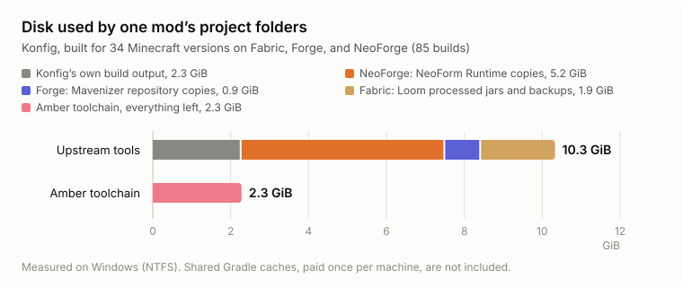

# Amber Loom

A fork of [Fabric Loom](https://github.com/FabricMC/fabric-loom) that takes less disk space when you build several mods or Minecraft versions on one machine.

## Why

I build my mods for every Minecraft version and loader they support. For Konfig that's 34 Minecraft versions and 85 builds. Fabric Loom, NeoForm Runtime, and Minecraft Mavenizer each keep a cache of Minecraft jars in the Gradle home, then copy those jars into every project again. Konfig's project folders took 10.3 GiB, and about 8 GiB of that was copies.

The Amber forks of all three share or link those jars instead, so each project keeps little more than its own build output.

<picture>
  <source media="(prefers-color-scheme: dark)" srcset="amber/disk-usage-dark.svg">
  
</picture>

On a copy-on-write file system like Btrfs, XFS, or a Windows Dev Drive, plain copies are already cheap, so the savings there are smaller.

## What's different

- Minecraft jars processed only from your dependencies (injected interfaces, mod javadoc, dependency access wideners) are stored once and shared between projects, instead of again in every project.
- The `.backup` copy kept next to each Minecraft jar is a hard link, so it doesn't take extra space.
- Access wideners from dependencies are hashed by their contents, so republishing a mod with a changed access widener under the same version rebuilds the Minecraft jar.

Apply `com.iamkaf.amber.loom`, or `com.iamkaf.amber.loom-remap` for obfuscated Minecraft versions, from `https://maven.kaf.sh`. Changes that would help everyone go back to Fabric Loom when they're ready.

The original Fabric Loom readme follows.

## Fabric Loom

A [Gradle](https://gradle.org/) plugin to setup a deobfuscated development environment for Minecraft mods. Primarily used in the Fabric toolchain.

* Has built in support for tiny mappings (Used by [Yarn](https://github.com/FabricMC/yarn))
* Utilises the Fernflower and CFR decompilers to generate source code with comments.
* Designed to support modern versions of Minecraft (Tested with 1.14.4 and upwards)
* Built in support for IntelliJ IDEA, Eclipse and Visual Studio Code to generate run configurations for Minecraft.
* Loom targets the latest version of Gradle 7 or newer 
* Supports Java 16 upwards

## Use Loom to develop mods

To get started developing your own mods please follow the guide on [Setting up a mod development environment](https://fabricmc.net/wiki/tutorial:setup).

## Debugging Loom (Only needed if you want to work on Loom itself)

_This guide assumes you are using IntelliJ IDEA, other IDE's have not been tested; your experience may vary._

1. Import as a Gradle project by opening the build.gradle
2. Create a Gradle run configuration to run the following tasks `build publishToMavenLocal -x test`. This will build Loom and publish to a local maven repo without running the test suite. You can run it now.
3. Prepare a project for using the local version of Loom:
   * A good starting point is to clone the [fabric-example-mod](https://github.com/FabricMC/fabric-example-mod) into your working directory
   * Add `mavenLocal()` to the repositories:
     * If you're using `id 'fabric-loom'` inside `plugins`, the correct `repositories` block is inside `pluginManagement` in settings.gradle
     * If you're using `apply plugin:` for Loom, the correct `repositories` block is inside `buildscript` in build.gradle
   * Change the loom version to `0.6.local`. For example `id 'fabric-loom' version '0.6.local'`
4. Create a Gradle run configuration:
   * Set the Gradle project path to the project you have just configured above
   * Set some tasks to run, such as `clean build` you can change these to suit your needs.
   * Add the run configuration you created earlier to the "Before Launch" section to rebuild loom each time you debug
5. You should now be able to run the configuration in debug mode, with working breakpoints.
